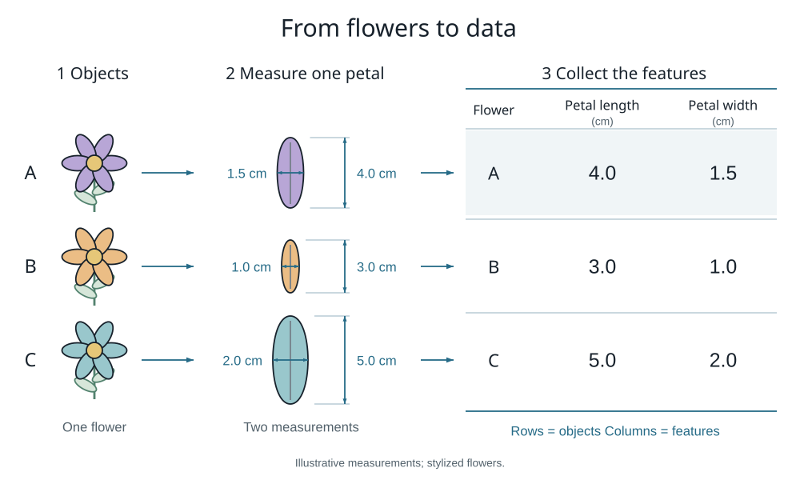

# Introduction · Matrix Thinking

This page contains companion materials for the introduction to **Matrix Thinking**. The link and QR code at the end of the introduction lead here.

## From flowers to data

We can describe a flower with a few numbers, such as the length and width of a petal. If we arrange measurements from several flowers in a table, each row represents a flower and each column represents a feature.

The measurements in the diagram are illustrative and are given in centimetres. They show how we can move from a real object to a numerical description of it.

[Open the diagram](assets/flower_features.svg)

## Reference guides

- [NumPy: the absolute basics for beginners](https://numpy.org/doc/stable/user/absolute_beginners.html) — an introduction to arrays and operations on them.
- [Pygame documentation](https://www.pygame.org/docs/) — a reference for the library we will use to display the results of our calculations.

You do not need to read these guides from cover to cover before starting the book. We will explore new tools gradually, as we need them for each task.

## Materials for later modules

Each module will have its own folder and a page like this one, explaining which files you need, which program to run, and how to move from one version to the next. Materials will be added as the modules are prepared. Further explanations and corrections for the introduction will appear here.
